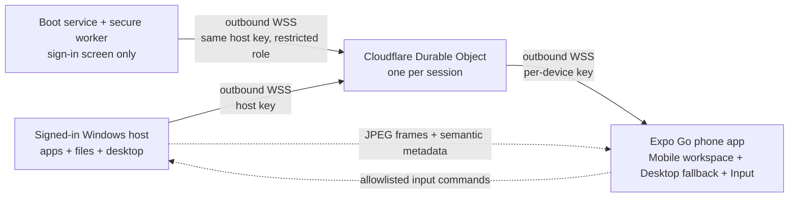

# PocketDesk

PocketDesk is a mobile-first remote workspace for Windows. Its Current view reconstructs the selected application's real interface as a responsive phone document: original tabs, menus, toolbars, navigation, content, fields, lists, editor, and status areas retain their spatial order while reflowing for a narrow screen. A full-screen live desktop remains available as a precision fallback.

The phone app runs in Expo Go. Both the phone and the Windows host make outbound WebSocket connections to a Cloudflare Worker, so the PC does not need an open inbound port and the phone can connect away from the local Wi-Fi.

## What works

- Full-screen app interfaces rebuilt from Windows UI Automation hierarchy and geometry
- Spatial reflow that preserves the selected app's actual tabs, menus, toolbar, navigation, content, fields, lists, editor, and status area
- Start-menu-style Home screen with pinned taskbar apps and common shortcuts
- Toolbar app library combining live open windows, pinned apps, and Start menu apps
- Real Windows application icons, extracted on demand and cached by the host
- Windows app-and-file search with safe opening through host-issued item IDs
- Open-app switching without finding a desktop taskbar
- Deep Raw UI Automation adaptation for menus, tabs, fields, document text, actions, options, and hierarchy
- Visual-region fallback that uses OCR only for segmentation, then stacks touchable crops of the actual selected window instead of exposing OCR fragments as controls
- Direct phone-native editing of fields and documents, with updates applied to the corresponding desktop element
- Full-screen adaptive JPEG desktop fallback at 3–5 FPS
- Direct touch for pixel-perfect click-and-drag control
- Trackpad, left/right click, scrolling, text paste, and common keyboard shortcuts
- Automatic semantic refresh after interactions and while the mobile workspace is visible
- Top-level Win32 window enumeration and handle-pinned selection, including File Explorer windows that are not exposed through `Process.MainWindowHandle`
- A dedicated File Explorer phone layout with real navigation, address/search fields, commands, tabs, folders, files, and status
- Phone-native file management with thumbnails, copy, move, rename, delete, folder creation, and downloads through the iOS share sheet
- A reusable adapter registry with tailored live layouts for Bezi, Chrome, ChatGPT/Codex, Windows Settings, Notepad and common document apps, and Windows Camera
- Packaged Windows app discovery and real manifest icons, so Camera, Settings, Notepad, and other Microsoft Store apps launch and identify correctly
- A touch-sized Camera interface with authenticated live preview refresh, mode, shutter, focus, brightness, settings, and camera-roll controls
- Direct standard-UVC control for the connected EMEET PIXY motor: precise/large pan and tilt moves, zoom, center/home, live position readouts, and three persistent presets
- Desktop-frame transport is suspended while the semantic workspace is active
- Smooth, Balanced, and Sharp stream profiles
- PC-managed trusted devices with 15-minute, one-use add codes
- A separate 256-bit credential for every phone, stored in the device Keychain/Keystore and revocable without affecting other phones
- Persistent host enrollment protected for the current Windows user, with automatic relay reconnection after restart
- A restricted LocalSystem secure host that starts at boot and hands off between the Windows sign-in/lock desktop and the normal signed-in host
- Remote password entry from a masked iOS-style composer; the secure path supports only screen, pointer, keyboard, quality, and connection messages
- Frame backpressure: stale frames are dropped instead of building latency
- Hibernating Cloudflare WebSockets for low idle relay cost

## Architecture



Cloudflare is a relay, not a remote browser. The applications continue running normally on the Windows PC. See [docs/ARCHITECTURE.md](docs/ARCHITECTURE.md) for the protocol and design details.

## Prerequisites

- Windows 10 or 11 for the host
- Node.js 20.19 or newer
- A Cloudflare account for the deployed relay
- Expo Go on the phone (this project deliberately targets Expo SDK 54 for current physical-device compatibility)

## 1. Install

From the repository root:

```powershell
npm install
npm run typecheck
npm test
```

## 2. Deploy the Cloudflare relay

Choose a strong admin token and keep it out of source control. It authorizes session creation.

```powershell
cd services/relay
npx wrangler login
npx wrangler secret put ADMIN_TOKEN
npm run deploy
```

Wrangler prints a URL similar to:

```text
https://pocketdesk-relay.<your-subdomain>.workers.dev
```

For local relay development, copy `.dev.vars.example` to `.dev.vars`, replace its placeholder, and run `npm run dev`. The `.dev.vars` file is ignored by Git.

## 3. Start the Windows host

Use the same admin token configured on the Worker:

```powershell
cd ../..
$env:POCKETDESK_RELAY_URL='https://pocketdesk-relay.<your-subdomain>.workers.dev'
$env:POCKETDESK_ADMIN_TOKEN='<the same strong admin token>'
npm run host
```

On its first run, the host prints the relay URL and a one-time add-device code. The code expires after 15 minutes; after a phone uses it, that phone remains trusted until it is removed on the PC. Optional flags are available:

```powershell
npm run host -- --relay https://example.workers.dev --admin '<token>' --profile balanced
```

Profiles are `smooth`, `balanced`, or `sharp` and can also be changed from the phone. A short-lived session is still available with `--temporary true --expires 8`. Use `--reset-pairing true` only when you need to replace the host enrollment.

### Trusted devices on the PC

List, add, and remove phones from Windows. Each add action creates a named, single-use code that expires after 15 minutes:

```powershell
.\scripts\manage-devices.ps1 -RelayUrl 'https://pocketdesk-relay.<your-subdomain>.workers.dev'
.\scripts\manage-devices.ps1 -RelayUrl 'https://pocketdesk-relay.<your-subdomain>.workers.dev' -Add -Name 'My iPhone'
.\scripts\manage-devices.ps1 -RelayUrl 'https://pocketdesk-relay.<your-subdomain>.workers.dev' -Remove -DeviceId '<id from the list>'
```

Removing a device revokes its credential and closes its active connection without changing any other trusted phone.

### Start after a Windows restart and control Windows sign-in

First redeploy the updated relay. Then, after the regular host has created its persistent enrollment, open PowerShell as Administrator and install the native secure host:

```powershell
.\scripts\install-secure-host.ps1 -Profile balanced
```

The installer publishes a self-contained x64 host, protects its minimal relay enrollment with machine-scoped Windows DPAPI, restricts the credential file to SYSTEM and Administrators, installs an automatic LocalSystem service, and also configures the regular host to start after this user signs in. The service connects before login and activates only when Windows is signed out or locked. It yields automatically to the regular host after a successful sign-in.

Remove the service and its machine credential with:

```powershell
.\scripts\install-secure-host.ps1 -Uninstall
```

For current-user autostart without sign-in control, use `install-host-autostart.ps1` instead. The native service is currently an unsigned development build; production distribution still requires Windows code signing and a hardened updater.

## 4. Run the Expo Go app

For a phone that is not on the development PC's local Wi-Fi, tunnel the Expo development bundle:

```powershell
cd apps/mobile
$env:EXPO_PUBLIC_RELAY_URL='https://pocketdesk-relay.<your-subdomain>.workers.dev'
npx expo start --tunnel
```

Scan Expo's QR code with Expo Go, paste an add-device code created on the Windows PC, and pair. PocketDesk stores the phone's unique trusted-device key in the iOS Keychain or Android Keystore and reconnects automatically whenever the PC is online. The Expo tunnel serves the development JavaScript bundle; the actual remote-desktop traffic travels through your Cloudflare relay.

## Phone controls

- **Home** — the default phone-sized Windows Start surface. Search apps and files, launch pinned taskbar apps, and jump into open windows.
- **Apps toolbar** — opens a full library of current windows, taskbar pins, and Start menu shortcuts from anywhere in the app.
- **Current** — the selected application's interface itself, reconstructed into a narrow responsive layout. Structured apps receive native tabs, menus, toolbars, editors, fields, lists, and status areas in their original order. Opaque apps receive touchable visual regions cropped from that real window.
- **Desktop** — a full-screen pixel view for canvas-based or otherwise opaque interfaces. One finger controls the PC, two fingers pan the viewport, and a pinch zooms up to 400%. Copy, Paste, and a visible iOS-style text composer stay immediately below the desktop. At Windows sign-in, PocketDesk locks itself to this view and replaces clipboard controls with Ctrl Alt Del, Tab, a masked password field, and Sign in. Windows honors simulated Ctrl Alt Del only when its local software-SAS policy permits it.
- **Input** — precision trackpad, mouse buttons, scrolling, a multiline visible text composer, Copy/Paste/Select All shortcuts, keyboard keys, and stream quality.

## Verification commands

```powershell
npm run typecheck
npm test
npm run secure-host:build
npm run relay:types
npm exec --workspace @pocketdesk/relay -- wrangler deploy --dry-run
npm run smoke:capture --workspace @pocketdesk/host
```

The relay integration smoke test expects `wrangler dev` on port 8787:

```powershell
npm run smoke:relay --workspace @pocketdesk/host
```

## Important MVP limits

- This is optimized for administration and productivity, not video playback or gaming. Expo Go does not include a custom native WebRTC stack, so this MVP uses low-latency JPEG frames.
- The installed secure host supports Windows sign-in and lock screens. It intentionally refuses an unlocked user's UAC consent desktop, credential pickers, and Windows Security surfaces; these also remain excluded from semantic scans and the app library.
- PC-to-phone downloads are limited to 250 MB per file, and phone-to-PC uploads are not implemented yet. The current host captures the whole Windows virtual desktop. Monitor selection, audio, and clipboard sync are not implemented yet.
- Cloudflare terminates TLS and relays the session; this MVP is not end-to-end encrypted above TLS. Read [docs/SECURITY.md](docs/SECURITY.md) before treating it as unattended or production-ready.

## Natural next milestone

Code-sign the boot service and installer, move the visual fallback to WebRTC hardware encoding, add end-to-end session encryption, and wrap device management in a signed Windows tray application. That gets a production-grade unattended host, smooth 30–60 FPS visual fallback, and graphical trusted-device management without giving up the primary semantic mobile workspace.
